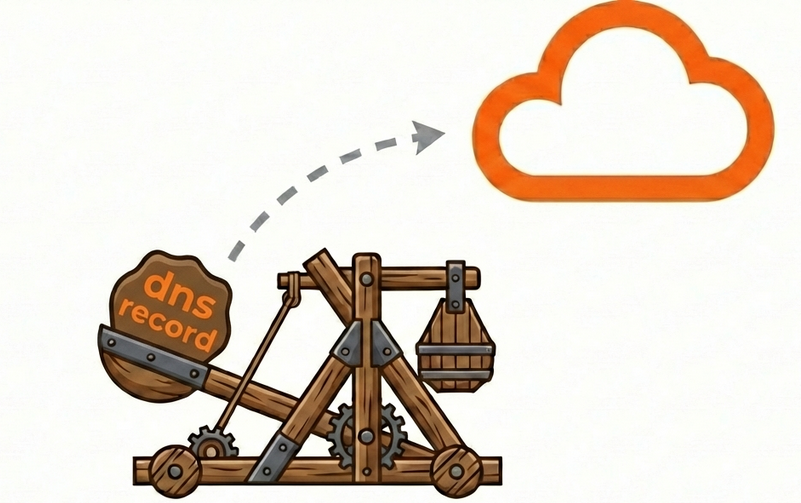

<p align="center">
  
</p>

<h1 align="center">cddns - Cloudflare Dynamic DNS Updater</h1>

<p align="center">
  <a href="https://github.com/iltumio/cddns/actions/workflows/ci.yml"></a>
  <a href="https://github.com/iltumio/cddns/actions/workflows/release.yml"></a>
  <a href="https://github.com/iltumio/cddns/releases/latest"></a>
  <a href="https://hub.docker.com/r/iltumio/cddns"></a>
  <a href="LICENSE"></a>
</p>

A fast, lightweight Cloudflare DDNS updater written in Rust with multiple operation modes including an interactive TUI, background service with cron scheduling, and Docker support.

## Features

- **Multiple DNS Records**: Update multiple A (IPv4) and AAAA (IPv6) records in a single run
- **Interactive TUI**: Full-featured terminal UI for managing DDNS updates
- **Background Service**: Run as a daemon with cron-based scheduling
- **Docker Support**: Lightweight container image (~19MB) based on scratch
- **Proxmox/Linux Ready**: Installation script with systemd service integration
- **Flexible Configuration**: TOML config files or CLI arguments
- **Hot Reload**: Service reloads config on each update cycle
- **Dry-run Mode**: Test your configuration without making changes

## Installation

### From Source

```bash
# Clone the repository
git clone https://github.com/iltumio/cddns.git
cd cddns

# Build release binary
cargo build --release

# Binary will be at ./target/release/cddns
```

### Proxmox/Linux (systemd)

```bash
# Download and run install script
curl -sSL https://raw.githubusercontent.com/iltumio/cddns/main/proxmox/install.sh | sudo bash

# Or clone and run locally
git clone https://github.com/iltumio/cddns.git
cd cddns
sudo ./proxmox/install.sh
```

### Docker

```bash
# Using docker-compose
docker-compose up -d

# Or directly with docker
docker run -d \
  --name cddns \
  -v ./config.toml:/config.toml:ro \
  ghcr.io/iltumio/cddns:latest \
  service -c /config.toml
```

## Configuration

Create a `config.toml` file (see `config.example.toml` for reference):

```toml
# Cloudflare API credentials
[cloudflare]
# Create token at: https://dash.cloudflare.com/profile/api-tokens
# Required permissions: Zone:Read, DNS:Edit
api_token = "your-api-token-here"

# DNS records to update (can specify multiple)
[[records]]
zone = "example.com"           # Your domain/zone name
name = "home.example.com"      # Full DNS record name
record_type = "A"              # "A" for IPv4, "AAAA" for IPv6
proxied = false                # Proxy through Cloudflare CDN
ttl = 1                        # TTL in seconds (1 = automatic)

[[records]]
zone = "example.com"
name = "vpn.example.com"
record_type = "A"
proxied = false
ttl = 300

# Optional: IPv6 record
# [[records]]
# zone = "example.com"
# name = "home6.example.com"
# record_type = "AAAA"
# proxied = false
# ttl = 1

# Optional settings
[settings]
ipv4_url = "https://api.ipify.org"   # IPv4 detection service
ipv6_url = "https://api6.ipify.org"  # IPv6 detection service
# force_ip = "1.2.3.4"               # Override auto-detection

# Service mode settings
[service]
# Cron expression (6 fields: sec min hour day month weekday)
cron = "0 */5 * * * *"    # Every 5 minutes
run_on_start = true       # Update immediately on service start
```

### Cloudflare API Token

1. Go to [Cloudflare API Tokens](https://dash.cloudflare.com/profile/api-tokens)
2. Click "Create Token"
3. Use "Edit zone DNS" template or create custom with:
   - **Zone:Read** - To list and find your zones
   - **DNS:Edit** - To create/update DNS records
4. Restrict to specific zones for better security

## Usage

### One-time Update with Config File

```bash
# Use config.toml in current directory
cddns

# Or specify config file path
cddns config -f /path/to/config.toml

# Dry-run mode (no changes made)
cddns config -f config.toml --dry-run
```

### One-time Update with CLI Arguments

```bash
cddns update \
  -t "your-api-token" \
  -z "example.com" \
  -r "home.example.com" \
  -T A \
  --ttl 300

# With environment variable
export CF_API_TOKEN="your-api-token"
cddns update -z example.com -r home.example.com
```

### Interactive TUI

```bash
# Launch TUI
cddns ui

# Load existing config into TUI
cddns ui -c /path/to/config.toml
```

**TUI Key Bindings:**
| Key | Action |
|-----|--------|
| `Tab` / `Shift+Tab` | Navigate fields |
| `Enter` / `u` | Update DNS record |
| `i` | Detect current public IP |
| `e` | Edit selected field |
| `s` | Save configuration |
| `S` | Start background service |
| `X` | Stop background service |
| `d` | Detach (leave service running) |
| `?` | Toggle help |
| `q` | Quit |

### Background Service

```bash
# Run as foreground service
cddns service -c /path/to/config.toml

# With systemd (after install script)
sudo systemctl enable cddns
sudo systemctl start cddns
sudo systemctl status cddns

# View logs
journalctl -u cddns -f
```

## Docker Deployment

### docker-compose.yml

```yaml
services:
  cddns:
    image: ghcr.io/iltumio/cddns:latest
    container_name: cddns
    restart: unless-stopped
    volumes:
      - ./config.toml:/config.toml:ro
    command: ["service", "-c", "/config.toml"]
```

### Building Docker Image

```bash
docker build -t cddns:latest .
```

The Docker image uses a multi-stage build:
1. **Build stage**: `rust:1-alpine` with musl for static linking
2. **Runtime**: `scratch` base for minimal size (~19MB final image)

## Proxmox/Linux Installation

The install script (`proxmox/install.sh`) will:

1. Download pre-built binary or build from source
2. Install to `/opt/cddns/`
3. Create config directory at `/etc/cddns/`
4. Set up systemd service with security hardening
5. Create symlink at `/usr/local/bin/cddns`

```bash
# After installation
sudo nano /etc/cddns/config.toml  # Edit config
sudo systemctl enable cddns        # Enable on boot
sudo systemctl start cddns         # Start service
```

### Uninstall

```bash
sudo systemctl stop cddns
sudo systemctl disable cddns
sudo rm /etc/systemd/system/cddns.service
sudo rm -rf /opt/cddns /etc/cddns
sudo rm /usr/local/bin/cddns
sudo systemctl daemon-reload
```

## Cron Expression Format

The service uses 6-field cron expressions:

```
┌──────────── second (0-59)
│ ┌────────── minute (0-59)
│ │ ┌──────── hour (0-23)
│ │ │ ┌────── day of month (1-31)
│ │ │ │ ┌──── month (1-12)
│ │ │ │ │ ┌── day of week (0-6, Sun=0)
│ │ │ │ │ │
* * * * * *
```

**Examples:**
| Expression | Description |
|------------|-------------|
| `0 */5 * * * *` | Every 5 minutes |
| `0 0 * * * *` | Every hour |
| `0 0 */6 * * *` | Every 6 hours |
| `0 0 0 * * *` | Daily at midnight |
| `0 30 4 * * *` | Daily at 4:30 AM |

## Verbose Output

Add `-v` flag for debug logging:

```bash
cddns -v config -f config.toml
cddns -v service -c config.toml
```

## Architecture

```
src/
├── main.rs        # CLI entry point (clap)
├── config.rs      # TOML configuration parsing
├── cloudflare.rs  # Cloudflare API client
├── ip.rs          # Public IP detection
├── service.rs     # Background service with cron
├── ipc.rs         # Unix socket IPC
└── tui.rs         # Ratatui terminal UI
```

## Dependencies

- **cloudflare**: Official Cloudflare API client
- **tokio**: Async runtime
- **ratatui/crossterm**: Terminal UI
- **tokio-cron-scheduler**: Cron scheduling
- **clap**: CLI argument parsing
- **serde/toml**: Configuration parsing

## License

MIT License - See [LICENSE](LICENSE) for details.

## Contributing

Contributions are welcome! Please feel free to submit a Pull Request.
